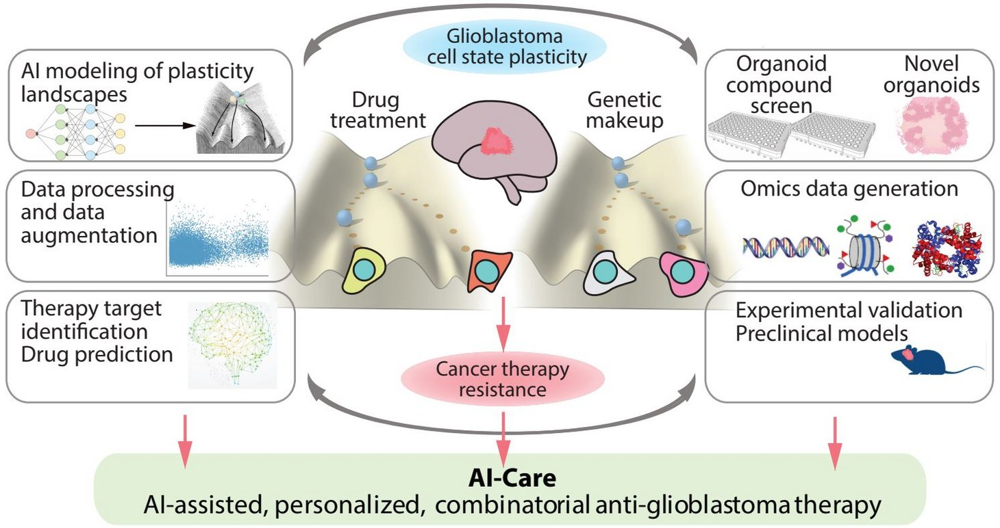

 
Glioblastomas are aggressive brain tumors characterized by a high degree of phenotypic heterogeneity and plasticity. Their ability to switch to resistant cell states renders conventional therapies ineffective. The goal of this project is to decipher the cancer plasticity code of glioblastoma using state-of-the-art AI and optimization techniques that characterize the drug response dynamics of glioblastoma. Our research aims for breakthroughs in understanding the biological basis of cancer plasticity and the development of personalized therapeutic treatments, tailored to each patient's unique characteristics to significantly improve outcomes and reduce the emergence of resistance. The project team's work has the potential to break new ground not only in the treatment of glioblastoma, but also in the treatment of other deadly cancers. The concept of AI-based personalized precision medicine may become a reality in the not so distant future. 

